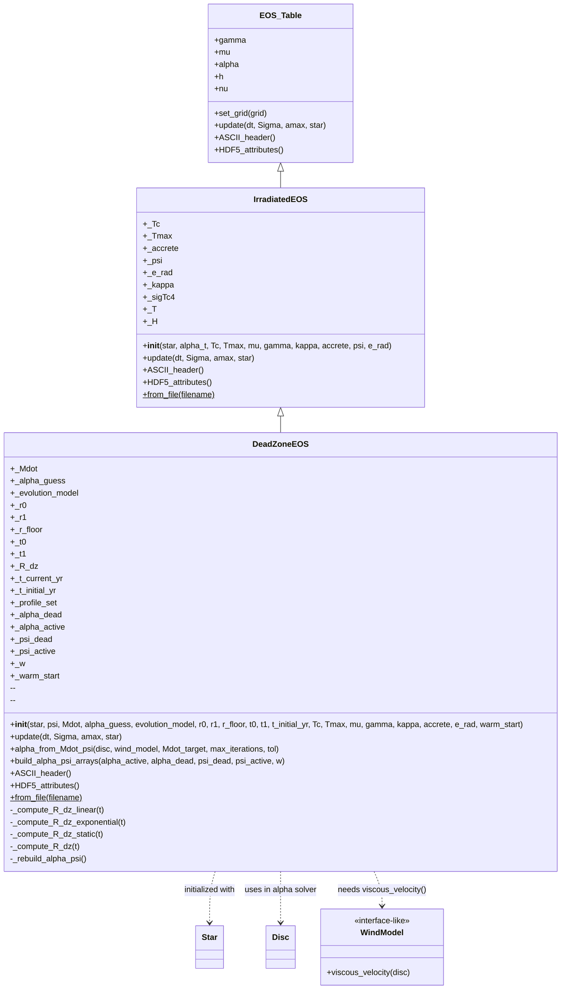

# DeadZoneEOS UML

If your viewer supports Mermaid, the class diagram is below.

## Plain-text fallback

DeadZoneEOS extends IrradiatedEOS, which extends EOS_Table.

- EOS_Table
  - Core EOS API: set_grid, update, ASCII_header, HDF5_attributes
- IrradiatedEOS
  - Adds irradiation/accretion thermal-balance fields and solver update
- DeadZoneEOS
  - Adds dead-zone state (R_dz evolution, profile scalars, warm_start)
  - Adds methods:
    - alpha_from_Mdot_psi
    - build_alpha_psi_arrays
    - _rebuild_alpha_psi
    - _compute_R_dz_{linear, exponential, static}
    - _compute_R_dz (dispatcher)
  - Overrides update, ASCII_header, HDF5_attributes
  - Provides from_file
